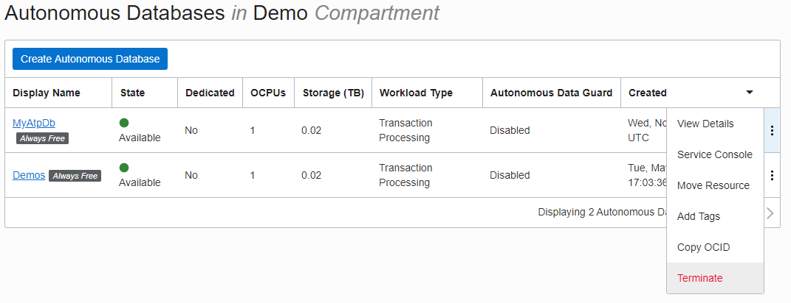
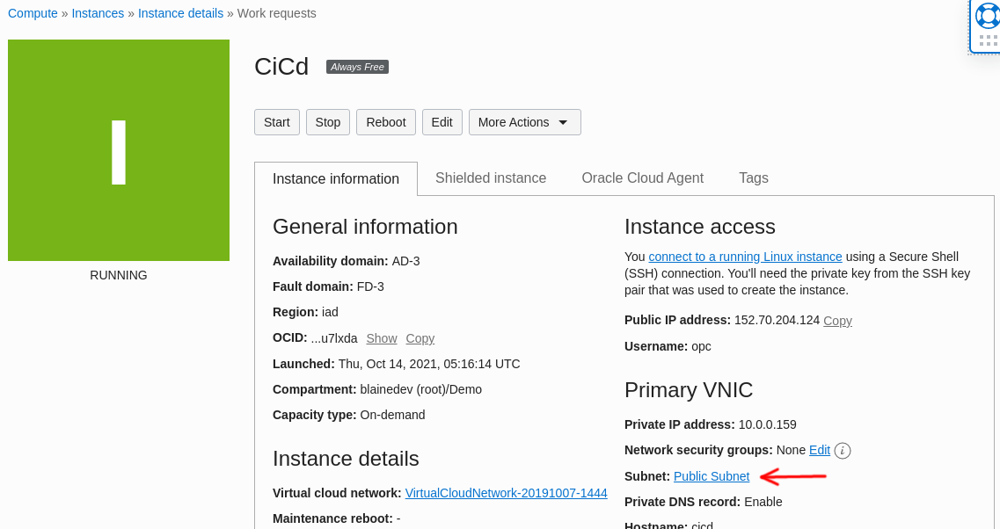
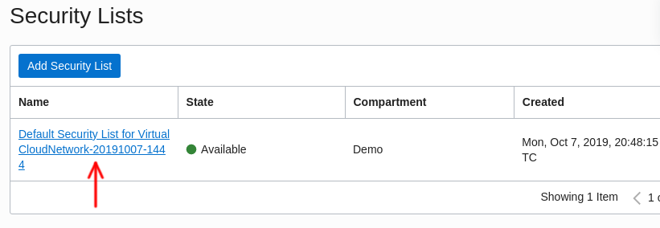
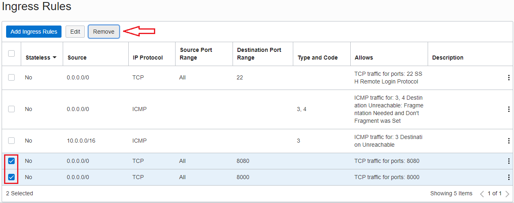
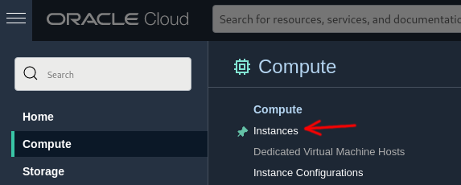
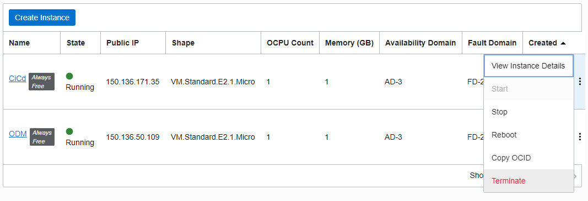

## Cleanup

### SSH Keys (Optional)

I recommend that you keep your ssh keys to use with future projects.  
If you choose to keep them, skip this section.

Run the following in your **Cloud Shell**
1. Remove the compute instance from your Known Hosts  
   ```
   ssh-keygen -R ${COMPUTE_IP}
   ```
1. Delete your Private Key  
   ```
   rm ~/.ssh/id_rsa
   ```
1. Delete your Public Key
   ```
   rm ~/.ssh/id_rsa.pub
   ```

### Database

1. Open the menu
1. Click "Autonomous Transaction Processing"  
     
1. Locate your database
1. Click the three dots menu
1. Click Terminate  
     
1. Enter your Database Name in the box
1. Click Terminate  
     

### Network Ports

1. Close ports 8080 and 8000 in your cloud Virtual Network (VNIC).
   1. Click "Public Subnet"
      
   1. Click the Security List name.  
        
   1. Check the box next to port 8080 and 8000.    
   1. Click "Remove".  
            
   1. Click "Remove".  
        

### Compute Instance

1. Open the menu
1. Click "Autonomous Transaction Processing"  
     
1. Locate your Compute Instance
1. Click the three dots menu
1. Click Terminate  
     
1. Check the box "PERMANENTLY DELETE THE ATTACHED BOOT VOLUME"
1. Click Terminate  
     

[Resources](index.html?lab=resources)
